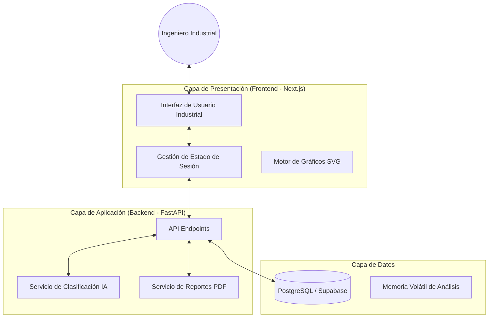
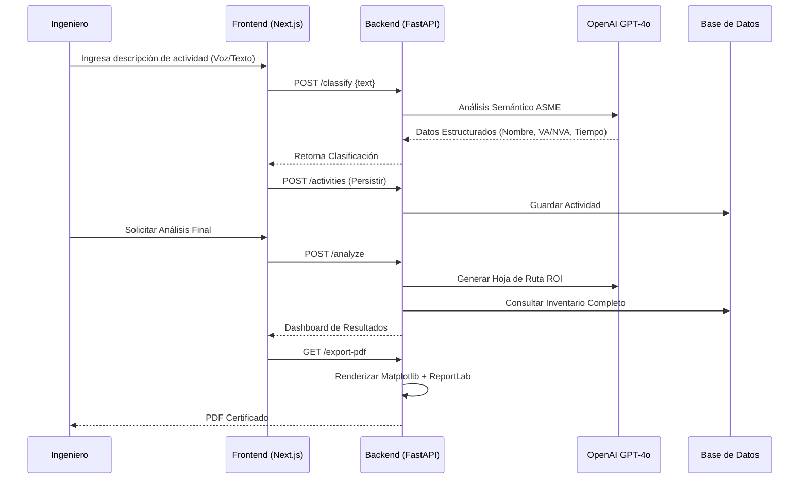

# Arquitectura del Sistema - ASME Industrial Precision

Este documento detalla la estructura técnica, los flujos de datos y los casos de uso de la plataforma ASME Industrial Precision.

## 1. Diagrama de Arquitectura General

La plataforma utiliza un modelo cliente-servidor desacoplado para separar la lógica de presentación de la inteligencia de procesamiento industrial.



## 2. Diagrama de Casos de Uso

El sistema está diseñado para cubrir el ciclo completo de una consultoría de ingeniería industrial.

```mermaid
useCaseDiagram
    Ingeniero --> (Configurar Sesión)
    Ingeniero --> (Capturar Actividades por Voz/Texto)
    Ingeniero --> (Validar Clasificación ASME)
    Ingeniero --> (Analizar Hoja de Ruta de Automatización)
    Ingeniero --> (Descargar Reporte Certificado)
    
    (Capturar Actividades) ..> (Clasificar con IA) : include
    (Validar Clasificación) ..> (Persistir en DB) : include
    (Descargar Reporte) ..> (Generar Gráficos Técnicos) : include
```

## 3. Flujo de Datos (Data Flow)

A continuación se detalla cómo viaja la información desde la captura de voz hasta el reporte final.



## 4. Estructura de Componentes Críticos

### Backend (Python/FastAPI)
*   `main.py`: Orquestador de rutas y lógica de negocio.
*   `services/database.py`: Capa de abstracción para operaciones SQL.
*   `services/pdf_service.py`: Generador de documentos de alta fidelidad.
*   `models/`: Definiciones de esquemas Pydantic para validación de datos.

### Frontend (React/Next.js)
*   `page.js`: Controlador principal del flujo de 5 pasos.
*   `components/ActivityList`: Gestor de captura e inventario en tiempo real.
*   `components/ProcessAnalysis`: Dashboard de desglose técnico y módulos de ingeniería.
*   `components/AutomationRoadmap`: Visualizador de recomendaciones estratégicas.
*   `components/FinalReport`: Resumen ejecutivo y punto de exportación.

## 5. Diseño de Base de Datos

El esquema se centra en la relación Sesión-Actividad para permitir múltiples análisis independientes.

*   **Sessions**: Almacena metadatos de la empresa, departamento y parámetros de costos.
*   **Activities**: Almacena el nombre, clasificación ASME, tiempos de ciclo, volumen diario y carga anual.
*   **Analysis**: (Cache/Persistente) Almacena las recomendaciones estratégicas vinculadas a la sesión.
