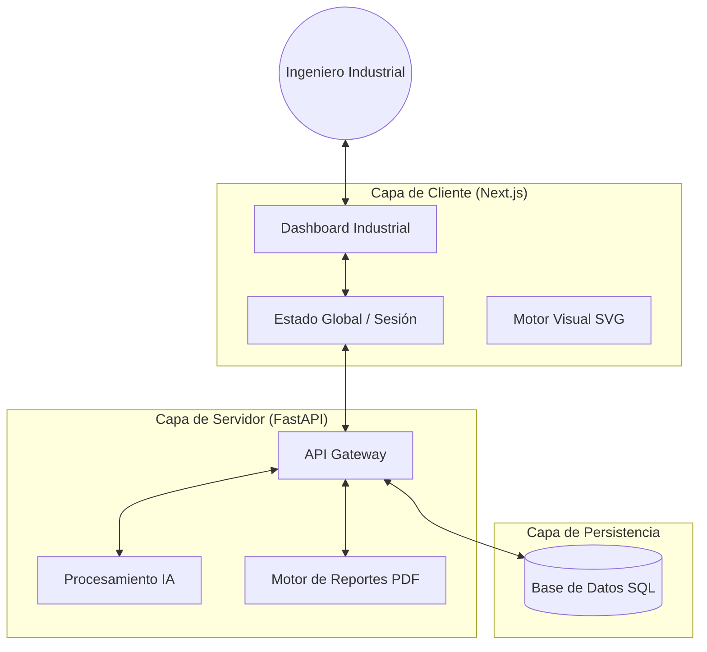
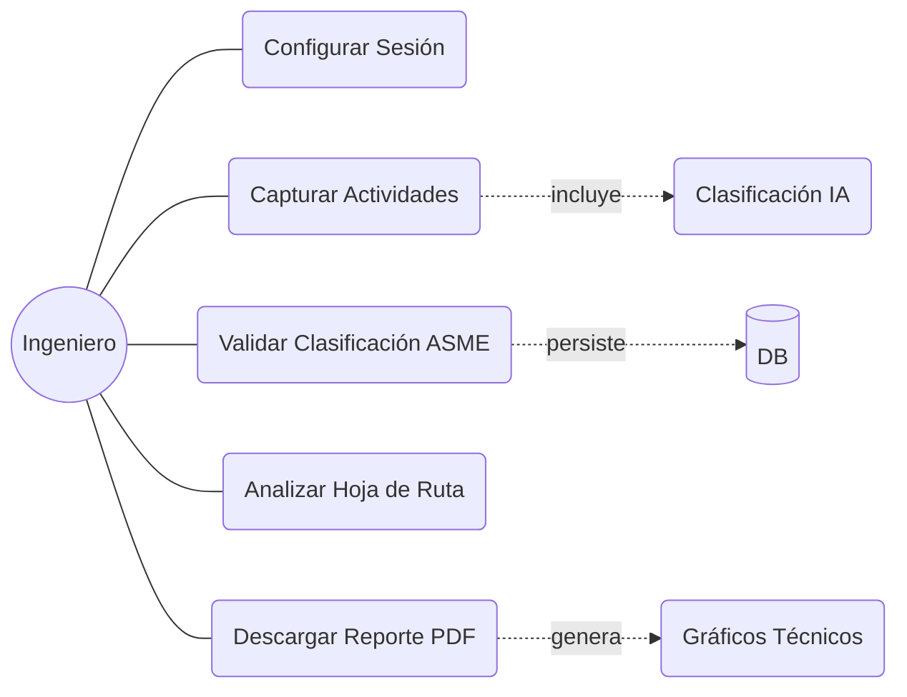
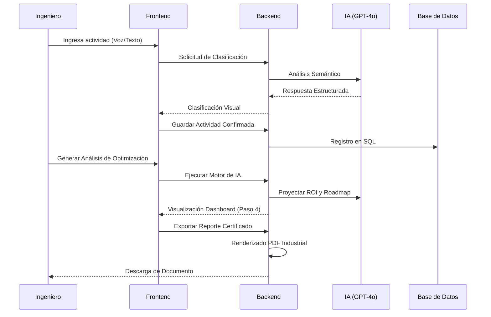

# Arquitectura del Sistema - ASME Industrial Precision

## Índice de Documentación
*   [🏠 Volver al Inicio](README.md)
*   [🖥️ Documentación del Frontend](frontend/README.md)
*   [⚙️ Documentación del Backend](Back/README.md)

---

## 1. Arquitectura de Alto Nivel
La plataforma utiliza una arquitectura desacoplada diseñada para la resiliencia industrial y el procesamiento de datos en tiempo real.

## 2. Diagrama de Casos de Uso
Representación de las interacciones principales del usuario con el sistema.

## 3. Flujo de Datos Secuencial
Muestra el ciclo de vida de una solicitud desde la captura hasta la certificación.

## 4. Desglose de Componentes Críticos

### Backend (Python/FastAPI)
*   **main.py**: Orquestación de rutas y gestión de errores.
*   **services/database.py**: Abstracción de la capa de datos (Psycopg2).
*   **services/pdf_service.py**: Generador de alta fidelidad con ReportLab.

### Frontend (React/Next.js)
*   **Paso 1-2**: Configuración de sesión y captura de datos distribuida.
*   **Paso 3**: Inventario dinámico con edición en tiempo real.
*   **Paso 4**: Dashboard modular con tarjetas de ingeniería y hoja de ruta.
*   **Paso 5**: Certificación final y punto de exportación.
